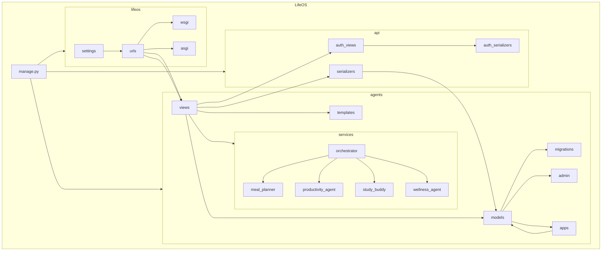

    

    <b>Automatic Architecture Diagrams from Code</b> 
    <a href="https://github.com/swark-io/swark">GitHub</a> • <a href="https://swark.io">Website</a> • <a href="mailto:contact@swark.io">Contact Us</a>

## Usage Instructions

1. **Render the Diagram**: Use the links below to open it in Mermaid Live Editor, or install the [Mermaid Support](https://marketplace.visualstudio.com/items?itemName=bierner.markdown-mermaid) extension.
2. **Recommended Model**: If available for you, use `claude-3.5-sonnet` [language model](vscode://settings/swark.languageModel). It can process more files and generates better diagrams.
3. **Iterate for Best Results**: Language models are non-deterministic. Generate the diagram multiple times and choose the best result.

## Generated Content
**Model**: GPT-4o - [Change Model](vscode://settings/swark.languageModel)  
**Mermaid Live Editor**: [View](https://mermaid.live/view#pako:eNqdk8tqwzAQRX_FaJ30A7zoKstCF-lSYBRrbA_ohTRKcEP-vbJMSCMsGqqd51zfeUlX1lsJrGXcjF64qfk6cNOkE-JpDXzgAJ_HNfgEVAI2PECGQIRmDM1-_95Erwq8RDK6hBErSDwhMJKbjeRiBEM19zPCpWA5lKFO_aoqDeDP2EOVE2inBJWC1XT1x1QhoTV1iZAaTZ06V0713vV2dcuxvp8gUMps_VoGCNWlUo0B_4LceStjT3hGmrs83Bd-ChTl3J2ilPML6gsoZSCELfu85j937vA_C09DQ6HwG3xVIiJN3YbJI_6QVe1-gepFW3a7CYuetTBpSm9uzuLypT3T8ikU9D60nIHtmAavBcr05K-c0QQaOGsbziQMIiri7JZE0cl0yQ8o0uQ1a8lH2LHUvj3Opr9_exvHibWDUAFuP5xAOfo) | [Edit](https://mermaid.live/edit#pako:eNqdk8tqwzAQRX_FaJ30A7zoKstCF-lSYBRrbA_ohTRKcEP-vbJMSCMsGqqd51zfeUlX1lsJrGXcjF64qfk6cNOkE-JpDXzgAJ_HNfgEVAI2PECGQIRmDM1-_95Erwq8RDK6hBErSDwhMJKbjeRiBEM19zPCpWA5lKFO_aoqDeDP2EOVE2inBJWC1XT1x1QhoTV1iZAaTZ06V0713vV2dcuxvp8gUMps_VoGCNWlUo0B_4LceStjT3hGmrs83Bd-ChTl3J2ilPML6gsoZSCELfu85j937vA_C09DQ6HwG3xVIiJN3YbJI_6QVe1-gepFW3a7CYuetTBpSm9uzuLypT3T8ikU9D60nIHtmAavBcr05K-c0QQaOGsbziQMIiri7JZE0cl0yQ8o0uQ1a8lH2LHUvj3Opr9_exvHibWDUAFuP5xAOfo)

