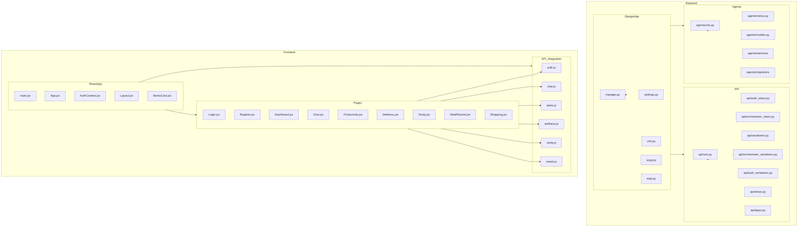

    

    <b>Automatic Architecture Diagrams from Code</b> 
    <a href="https://github.com/swark-io/swark">GitHub</a> • <a href="https://swark.io">Website</a> • <a href="mailto:contact@swark.io">Contact Us</a>

## Usage Instructions

1. **Render the Diagram**: Use the links below to open it in Mermaid Live Editor, or install the [Mermaid Support](https://marketplace.visualstudio.com/items?itemName=bierner.markdown-mermaid) extension.
2. **Recommended Model**: If available for you, use `claude-3.5-sonnet` [language model](vscode://settings/swark.languageModel). It can process more files and generates better diagrams.
3. **Iterate for Best Results**: Language models are non-deterministic. Generate the diagram multiple times and choose the best result.

## Generated Content
**Model**: GPT-4o - [Change Model](vscode://settings/swark.languageModel)  
**Mermaid Live Editor**: [View](https://mermaid.live/view#pako:eNqNVktv4yAQ_iuRz233nsNKaaKVKrVS1Ky0B7yyiE1tWhsQ4KTeqv99B_AT8G5zoDPzfQzMw0M_kpwXJNkmKSslFtXm5yFlG_ip9uwM9zh_I6xw1gVyeMWs5DshJsz8GsxwSTLRISfdie73kqGI1pSVCg1CSGllrZBZQuiqSorMEkLYQDiA7PUjAeyOD95-QTN7Mgjf4qfjVlfZhZKrI01qSOUyr4jSEmsuZ1tCcyxDkuKa_iHS7Znp_znH37kGrkTmb_eN4bYpsJVYsBC9LxC-WJiSMK08N9bWl8fKaxVyxP5ejrlytQZ6f3LntGgxLjQnI2_QfWcULq8pZ5PD0eLH7AU_Bv5DcqbjX9szwbmOfGyUIbPcvar3MPEINsQQU9XcHPWu0Q6UvZMj1Bp3vNXo0f6J4GeIlGc5lgW6N-IeJI-2VuUjpMkrcs1LiOfRrJGzJCmp0kSi516IcAqsqjM31zkMUoSVV1ijPSwRTEhetLmmF6o7dJwpEe6V1DUjSqFfvRDhKN0WHTqZNYI2BNeZqDFjENcTKEcnxxxVXAgYl-jUC1_MM4y57AHq2zdjpBXg60RGAIeRRFk4d8nyYI3Vm7K4lULCkCDLuU5JiuXIclSfp0ianBMrLQmxT2p8hTa3t9_9p2pULTg-A555NoSAYm3DA-FZx0dgaQ8n_RKfzdV_bFxl-bN5iUbOMwO4t9jYnHGaq2vY3NUEunEZmIfpGPLHaeigYaBZcDYLFvZo71rylAIoim8f2ta3j_3qA_M-9bGxOX1gbMqUJTdJQyQM4gL-l_pIE12RhqTJdpMmBXnBba3T5BNIrSiwJgeKIaAm2WrZkpsEouCnjuWDLnlbVsn2BbyTz7-13QGl) | [Edit](https://mermaid.live/edit#pako:eNqNVktv4yAQ_iuRz233nsNKaaKVKrVS1Ky0B7yyiE1tWhsQ4KTeqv99B_AT8G5zoDPzfQzMw0M_kpwXJNkmKSslFtXm5yFlG_ip9uwM9zh_I6xw1gVyeMWs5DshJsz8GsxwSTLRISfdie73kqGI1pSVCg1CSGllrZBZQuiqSorMEkLYQDiA7PUjAeyOD95-QTN7Mgjf4qfjVlfZhZKrI01qSOUyr4jSEmsuZ1tCcyxDkuKa_iHS7Znp_znH37kGrkTmb_eN4bYpsJVYsBC9LxC-WJiSMK08N9bWl8fKaxVyxP5ejrlytQZ6f3LntGgxLjQnI2_QfWcULq8pZ5PD0eLH7AU_Bv5DcqbjX9szwbmOfGyUIbPcvar3MPEINsQQU9XcHPWu0Q6UvZMj1Bp3vNXo0f6J4GeIlGc5lgW6N-IeJI-2VuUjpMkrcs1LiOfRrJGzJCmp0kSi516IcAqsqjM31zkMUoSVV1ijPSwRTEhetLmmF6o7dJwpEe6V1DUjSqFfvRDhKN0WHTqZNYI2BNeZqDFjENcTKEcnxxxVXAgYl-jUC1_MM4y57AHq2zdjpBXg60RGAIeRRFk4d8nyYI3Vm7K4lULCkCDLuU5JiuXIclSfp0ianBMrLQmxT2p8hTa3t9_9p2pULTg-A555NoSAYm3DA-FZx0dgaQ8n_RKfzdV_bFxl-bN5iUbOMwO4t9jYnHGaq2vY3NUEunEZmIfpGPLHaeigYaBZcDYLFvZo71rylAIoim8f2ta3j_3qA_M-9bGxOX1gbMqUJTdJQyQM4gL-l_pIE12RhqTJdpMmBXnBba3T5BNIrSiwJgeKIaAm2WrZkpsEouCnjuWDLnlbVsn2BbyTz7-13QGl)

